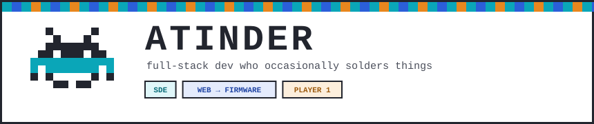
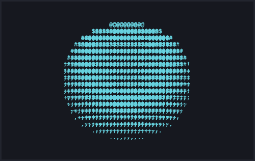

<!-- Pixel banner (assets/banner.svg lives in this repo) -->

  

<!-- Typing intro -->

  

## ■ INSERT COIN

  

SCORE 001337 &nbsp;·&nbsp; HI-SCORE ∞ &nbsp;·&nbsp; CREDITS 42

## ▸ ABOUT

- ◆ I ship web apps by day and flash microcontrollers by night — sometimes the ESP32 wins.
- ◆ Ruby to C++ and most stops in between; I pick the language the problem deserves.
- ◆ Firm believer that "it works on my breadboard" is a valid CI stage.
- ◆ Currently: building things with Next.js on one monitor and a serial monitor on the other.

## ▸ LOADOUT

**Languages**

**Web / MERN**

**Hardware / Embedded**

## ▸ STATS.EXE

  
  

## ▸ 2-PLAYER MODE

---

▲ ▲ ▼ ▼ ◀ ▶ ◀ ▶ B A &nbsp;—&nbsp; THANKS FOR SCROLLING &nbsp;·&nbsp; CONTINUE? 9…8…7…

